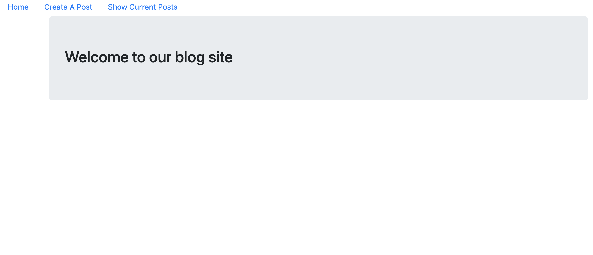
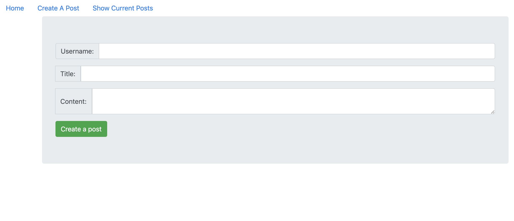
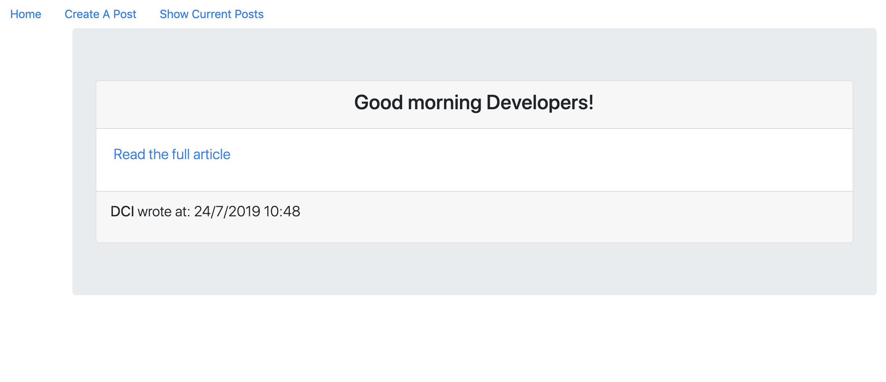

## Instructions for students:

### Create a Mock Blog Application

-   Create a blog.
-   Your blog should contain a welcome page.
-   You should display the navigation bar at all times.
-   The user should be able to create a post through the form on the /create route.
-   Once the user creates a post, they should be redirected to the /show route, which shows all the posts that were created.
-   Every post should depict the information about who the author is, when the post was created, the title and the content of it.

*   Start the project with create react app.

*   Use different components and import them into the corresponding file. _Create the following Components: App, Home, ShowAllPosts, ShowSinglePost_.

*   Use React Router.

*   Use Lifecycle methods.

*   See images for reference:
    
    
    

**Bonuses**

-   User should be able to also see a single post by clicking on the "read full article" link.
-   Give the user the ability to delete their post.
-   Give the user the ability to edit their post.

### Rules

-   This is an individual assignment.
-   Deadline: 3 Hrs.
-   Use **Git properly**.
-   Feel free to document your code with comments.
